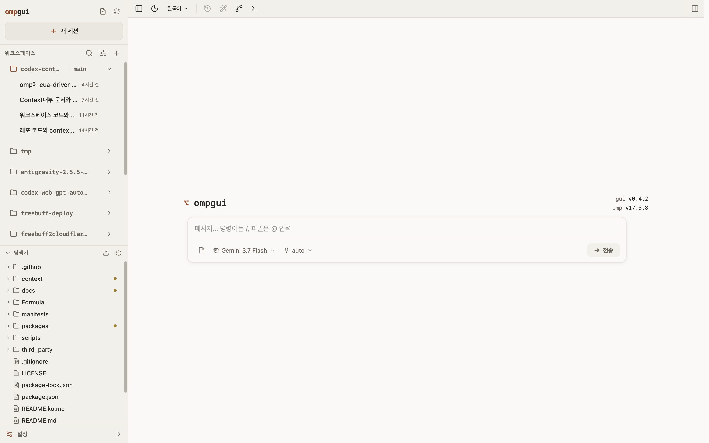
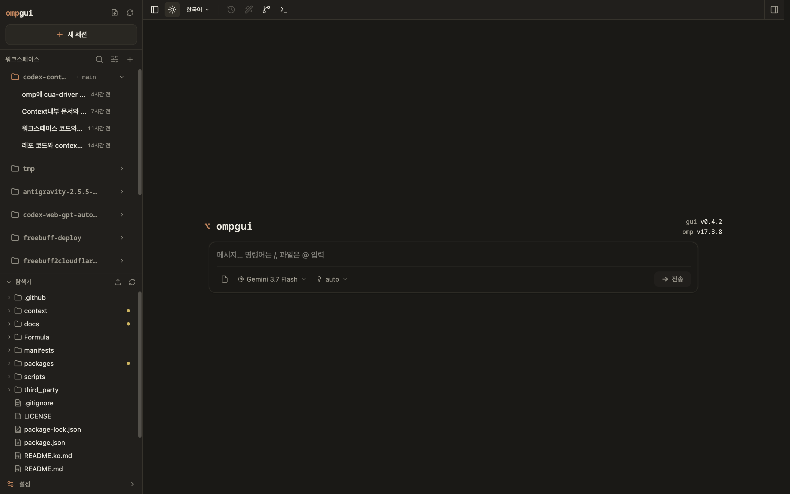

# ompgui

[English](./README.md) | [한국어](./README.ko.md) | [日本語](./README.ja.md) | [简体中文](./README.zh-CN.md)

> **Android APK (Android 12+)** — Use the Kotlin companion app to connect to a remote ompgui server, with a read-only offline snapshot of the latest session. [Download ompgui Remote v0.6.3](https://github.com/dbc-hbin/ompgui/releases/download/v0.6.3/ompgui-remote-v0.6.3.apk) · [Release notes](https://github.com/dbc-hbin/ompgui/releases/tag/v0.6.3)

Local web UI for the [oh-my-pi (omp) coding agent](https://github.com/can1357/oh-my-pi). ompgui reads your local omp session files and gives you a browser workspace for session browsing, real-time chat, model configuration, skill management, and project file preview.



<details>
<summary>Dark theme</summary>



</details>

## Requirements

- [omp](https://github.com/can1357/oh-my-pi) installed and on your `PATH` (or point `OMP_WEB_OMP_BIN` at the binary)
- Node.js 22.19.0 or newer (`node --version`)

## Quick Start

**Run without installing:**

```bash
npx ompgui@latest
```

**Or install globally:**

```bash
npm install -g ompgui
ompgui
```

Update a global installation with `ompgui update`.

Then open [http://127.0.0.1:30177](http://127.0.0.1:30177). The CLI will try to open the browser automatically after the server is ready. ompgui listens on `127.0.0.1` by default.

**Options:**

```bash
ompgui --port 8080              # custom port
ompgui --hostname 0.0.0.0       # expose on a trusted network
ompgui -p 8080 -H 0.0.0.0       # combine options
ompgui --no-open                # do not open the browser automatically
ompgui --password "a-long-random-password" # password-only sign-in without POSIX inline-env syntax

PORT=8080 ompgui                # environment variable is also supported
OMP_WEB_HOSTNAME=0.0.0.0 ompgui # explicit network exposure
OMP_WEB_PASSWORD='a-long-random-password' ompgui # env-variable form (POSIX: inline or exported)
OMP_WEB_NO_OPEN=1 ompgui        # useful when running as a background service

# Windows (PowerShell / CMD)
# $env:OMP_WEB_PASSWORD="a-long-random-password"; ompgui
# or
# ompgui --password "a-long-random-password"
```

Set `OMP_WEB_PASSWORD` (or pass `--password`) to protect the interface and every API endpoint with a themed, password-only sign-in screen. A successful sign-in creates an HTTP-only signed session cookie for 30 days; changing the configured password invalidates existing sessions. Leaving the variable unset disables authentication. Remote use still requires HTTPS through a trusted reverse proxy or VPN so the password and session cookie cannot be intercepted. On Windows the env-variable syntax is `$env:OMP_WEB_PASSWORD="..."`; `ompgui --password "..."` works in every shell without that extra step.

## Remote & Mobile Access (Tailscale Recommended)

For accessing `ompgui` from mobile devices (iPhone, iPad, Android) or external laptops, **using [Tailscale](https://tailscale.com/) is strongly recommended**. Tailscale creates a private, point-to-point WireGuard mesh VPN between your devices without exposing your host machine to the public internet or requiring port forwarding.

### 1. Configure Password (Required for Remote Access)

When binding to external network interfaces, setting a password is required to secure the workspace:

```bash
# CLI option: bind to all interfaces with a password
ompgui -H 0.0.0.0 --password "your-strong-password"

# Or via environment variables
OMP_WEB_HOSTNAME=0.0.0.0 OMP_WEB_PASSWORD="your-strong-password" ompgui
```

### 2. Steps to Connect via Tailscale

1. **Install Tailscale**: Download and sign into [Tailscale](https://tailscale.com/download) on both your host machine and your mobile device using the same account.
2. **Start ompgui on your host machine**:
   ```bash
   ompgui --hostname 0.0.0.0 --password "your-strong-password"
   ```
3. **Access from your mobile browser**:
   - Navigate to your host's Tailscale IP (e.g. `100.x.y.z`) or MagicDNS machine name:
     ```text
     http://100.x.y.z:30177
     # Or with MagicDNS enabled:
     http://my-macbook:30177
     ```
4. **Log in**: Enter your configured password to securely control and chat with your coding agent on mobile.

### Security and troubleshooting

- The server binds to `127.0.0.1` by default. A non-loopback hostname is an explicit opt-in and should only be used behind a trusted network boundary; ompgui is not safe to expose publicly.
- File APIs are allow-listed to the selected workspace, its valid Git worktrees, session-referenced directories, and explicitly selected roots. Paths are canonicalized to reject traversal and symlink escapes.
- `omp` is resolved from `OMP_WEB_OMP_BIN` first, then `PATH`. If live chat cannot start, run `omp --version` in the same terminal or set `OMP_WEB_OMP_BIN` to the executable's absolute path.
- Session history remains native OMP JSONL. OMP owns live-session writes; ompgui reads the files directly and only performs explicit title, archive, and delete maintenance when it is not racing a live OMP write.
- Session archive uses OMP's native `archive/sessions/<cwd>/<file>.jsonl.gz` layout and moves sibling artifacts with the transcript; the original JSONL bytes are preserved inside the gzip.

## Features

- **Pick work back up**: browse previous omp conversations by project without digging through terminal history or session paths.
- **Try different directions safely**: continue from an earlier message or fork a session into a separate route.
- **Keep the sidebar tidy**: archive an inactive session without deleting its native transcript, or delete it explicitly when it is no longer needed.
- **Work across branches**: switch Git worktrees from the sidebar so new sessions and the Explorer follow the checkout you choose.
- **Chat beside the project**: browse files on the left and preview source, docs, images, audio, and PDFs on the right while the agent works.
- **Preview markdown faithfully**: YAML frontmatter renders in a summary card (title + key/value rows), math fences stay aligned inside lists, and CJK ranges like `5~7U` are no longer mangled (GFM now requires `~~` for strikethrough).
- **Pick projects naturally on Windows**: a drive picker at the filesystem root and a case-folded, symlink-aware project identity keep the sidebar stable across drives and worktrees.
- **See session state clearly**: context usage, cost, compaction state, and system prompt details are visible from the top bar.
- **Configure less from the terminal**: manage models, login/API keys, model tests, native OMP controls (advisor, approval, Bash policy, thinking, compaction, memory, auto-learn, retry/fallback), skills, plugins, and project MCP servers from the web UI.
- **MCP management in Settings**: a dedicated MCP tab lists installed project servers with status (enabled / disabled / invalid), supports add/edit/rename/validate/remove, and surfaces configuration failures as corner toasts.
- **Keep OMP current**: check the installed runtime version, update it, and restart active sessions from Settings when needed.
- **Stay informed**: opt into browser notifications when an agent finishes, and check installed skills for updates.
- **Jump anywhere with ⌘K**: a command palette (⌘K / Ctrl+K) for switching sessions, starting new ones, and toggling the theme.
- **Warm, paper-like design**: light and dark themes with serif display type and WCAG AA-verified contrast, built on a token-driven UI kit (Base UI primitives, cmdk, lucide icons).

## Configuration

| Variable | Meaning |
| --- | --- |
| `PORT` | Server port (default `30177`; `-p/--port` wins) |
| `OMP_WEB_HOSTNAME` | Bind hostname (default `127.0.0.1`; `-H/--hostname` wins) |
| `OMP_WEB_PASSWORD` / `--password` | Password for the sign-in screen; `--password` works in every shell (PowerShell/CMD) without ` $env:` syntax |
| `OMP_WEB_NO_OPEN` | Set to `1`/`true` to skip auto-opening the browser |
| `OMP_WEB_OMP_BIN` | Absolute path to the `omp` binary when it is not on `PATH` |
| `PI_CODING_AGENT_DIR` | Point at another omp agent directory (default `~/.omp/agent`) |
| `HTTP_PROXY` / `HTTPS_PROXY` / `NO_PROXY` | Standard proxy variables for server-side requests |

## Architecture

ompgui is a Node-hosted Next.js app that drives your installed `omp` binary — it does not embed the agent:

- **Live sessions**: spawns `omp --mode rpc-ui` (NDJSON over stdio), one child process per active session, so the agent version is always exactly what you have installed. It negotiates RPC v2 when the installed OMP advertises it, uses bounded chunk reassembly for large frames, and falls back to v1 for older versions. Host env (`PORT`, `NEXT_*`, `NODE_ENV`) is stripped before spawn, and shutdown is graceful on both POSIX (process-group) and Windows (`taskkill /t`).
- **Session browsing**: reads omp's session files (`~/.omp/agent/sessions/<encoded-cwd>/<timestamp>_<uuid>.jsonl`) directly; title, archive, and delete are narrow native-file maintenance operations guarded against live OMP writes. Projects are grouped by a stable `projectKey` (Windows case-folded, symlink-resolved) so the sidebar doesn't jump between drives or worktrees.
- **Models and auth**: RPC commands against the omp child process with strict payload validation (unknown-shape guards, safe fallbacks); the Models panel edits `models.yml` in the omp agent directory, dropping blank placeholder rows and rejecting ambiguous `enabledModels` entries.
- **Native settings**: the General/MCP settings panels read and write the allow-listed subset of `~/.omp/agent/config.yml` (or `config.yaml` fallback), preserving unrelated keys and comments. Changes apply to new and restarted sessions.
- **Skills and plugins**: scans omp's skill directories (`~/.omp/agent/skills`, project `.omp/skills`, and compat dirs) and shells out to `omp plugin` for plugin management.
- **MCP servers**: project servers are managed through OMP's native locations (`.omp/mcp.json`, then compatibility files) at the git top level, validated against the stdio/http/sse schema and written atomically.
- **File access**: file browsing and preview are scoped to the selected project directory and working directories that appear in sessions; paths are canonicalized via a single `isWindowsAbsolutePath`/`samePath` helper and symlink escapes are rejected after `realpath` resolution. On Windows the directory picker offers a drive list at the root.
- **Forks vs in-session branches**: Fork creates a new `.jsonl` file. "Edit from here" creates another branch inside the same session file.

## Development

```bash
npm install
npm run dev
```

The local dev server runs at [http://127.0.0.1:30178](http://127.0.0.1:30178).

Common checks:

```bash
npm run typecheck      # type check
npm run lint           # ESLint (zero warnings enforced)
npm test               # run test suite
npm run build          # production build
```

Avoid running `next build` / `npm run build` during local development. It writes to `.next/` and can interfere with the dev server; leave builds for release work.

## Internationalization

ompgui supports English, Simplified Chinese (简体中文), Japanese (日本語), and Korean (한국어) with translated UI strings across all languages. The language is auto-detected from `navigator.language` and can be switched at runtime via the language menu in the top bar. The choice persists across sessions.

- Dictionaries: `lib/i18n/locales/{en,zh-CN,ja,ko}.json`
- Framework: `lib/i18n/index.tsx` — a lightweight store built on `useSyncExternalStore` with `{var}` interpolation and plural support (`.one`/`.other`)
- API error messages are translated via stable error codes (`errors.<code>`) looked up client-side

## Quality

- **Accessibility**: WCAG AA compliant — Lighthouse a11y score 100/100, keyboard navigation throughout, focus-visible rings, ARIA roles
- **Performance**: memoized list components, RAF-gated scroll/mouse handlers, debounced search, streaming JSONL reader, ETag-cached session listing
- **Resilience**: graceful shutdown of spawned omp processes (process-group kill), error boundaries, atomic session file rewrites
- **Tests**: a focused test suite covering session parsing, terminal input, markdown rendering, message display, native settings, and MCP configuration

## Credits

ompgui is a fork of [agegr/pi-web](https://github.com/agegr/pi-web) (MIT), the web UI for the [earendil/pi-mono](https://github.com/earendil-works/pi) pi coding agent, adapted for [can1357/oh-my-pi](https://github.com/can1357/oh-my-pi).

## License

MIT
